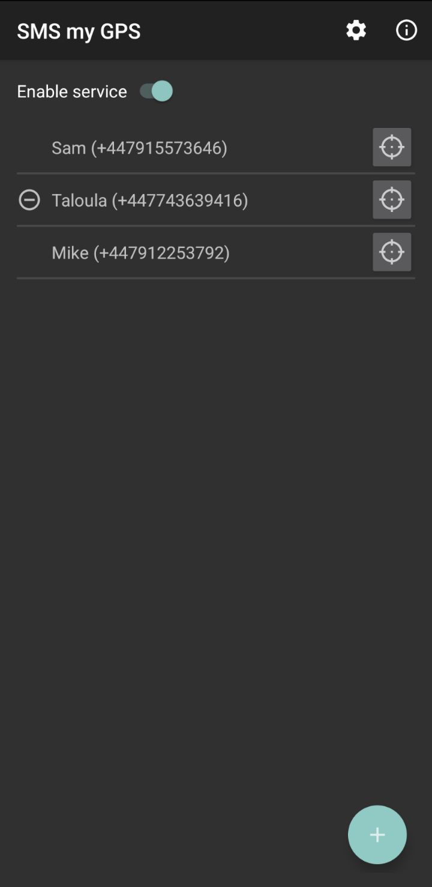
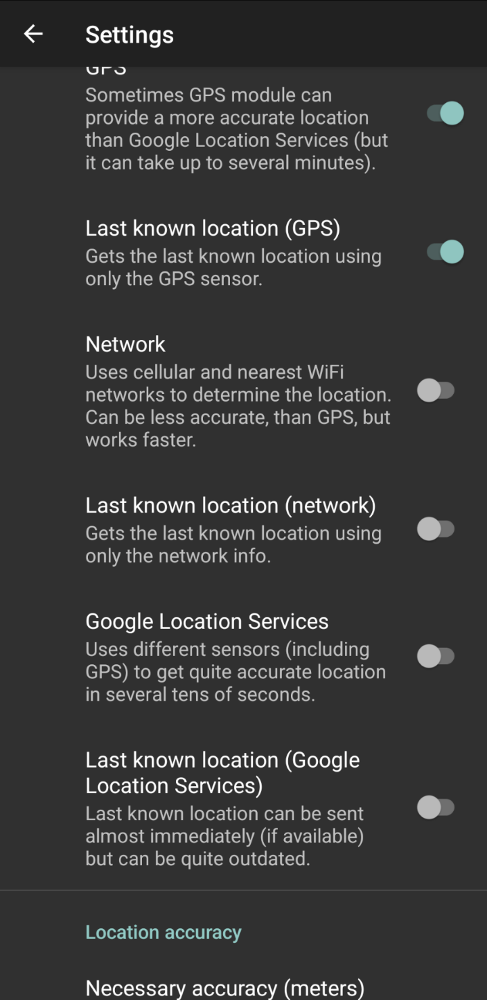
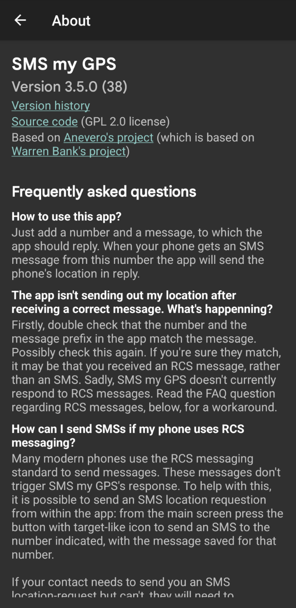

# SMS my GPS

This android app is designed to automatically send your location in
response to an SMS from a permitted phone number with a pre-agreed prefix.

To set this up simple add the permitted numbers with the corrosponding
pre-agreed prefix to the app. The app will then send an SMS containing
your coordinates in response to an appropriate SMS message.

This fork is based on [Anevero's
project](https://github.com/anevero/sms_my_gps) which is, in turn, based
on [Warren Bank's project](https://github.com/warren-bank/Android-SMS-Automatic-Reply-GPS).

## Features

- Add any items and corresponding prefixes to the app. You can edit already
added items later or delete them. You can add the number by choosing the
appropriate contact or manually. It's better to use full number format with
the country code (but the app still will work with short numbers, because
actually it checks number postfix match).
- Enable the foreground service. While working, it checks all the incoming SMS,
and if the match is found, sends an SMS as a reply. When service is running,
the corresponding notification is shown in the notification area.
- Set up location providers to use. Several ones are available; each can be
better than others in some situations (check their descriptions in the app).
Each provider initiates sending the corresponding message (so if you enable
several providers, the app will send several messages with the location info
from each of them).
- Set up location accuracy and maximum location requests number. When the app
needs to get the location from the provider, it will make requests to the
provider until the necessary accuracy or the maximum attempts number is
reached, and send the location only after that. One request to the provider
usually takes around 5 seconds. This feature allows getting a much more
accurate location because different device sensors (for example, GPS) often
need some time to determine the real location.

## Changes in the fork

- Allowed sending a location-request SMS from within the app. This is
  necessay on phones which use RCS messaging by default, as in this case
  it is awkward to send an SMS.
- Allowing stored numbers to optionally have names recorded. This is
  simply to ease number management.
